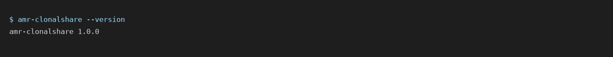

# 1. Install

## From PyPI

Python 3.11 or later on Linux, macOS or Windows.

```bash
python -m pip install amr-clonalshare
amr-clonalshare --version
```

The core needs `numpy`, `scipy`, `pandas`, `scikit-learn`, `pyyaml` and
`pandera`, which `pip` resolves. Two extras exist: `phylo` adds `dendropy` for
the phylogenetic convergence test on small cohorts, `plot` adds `matplotlib`.

```bash
python -m pip install "amr-clonalshare[phylo,plot]"
```



## From the repository

```bash
git clone https://github.com/maciejkochanowski/amr-clonalshare.git
cd amr-clonalshare
python -m pip install -e ".[dev]"
pytest -q
```

Every test that exercises an estimator checks it against a known answer, and
the suite is the first thing to run after any change to the environment.

## In a container

The repository root holds a `Dockerfile` that pins the exact library versions
the published results were computed with. See
[Container and reproducibility](08-container.md). Use it when the result has
to be reproduced on another machine, or when the Python environment on the
target machine cannot be changed.

## Threads

The pipeline uses BLAS through NumPy and SciPy. On a shared machine, or for a
run whose numbers must be compared across machines, pin the thread count:

```bash
amr-clonalshare --config config.yaml --results-dir out --threads 1
```

`--threads` sets `OMP_NUM_THREADS` and its siblings before the numerical
libraries are imported, so it takes effect; setting the variables after the
first import would not.
