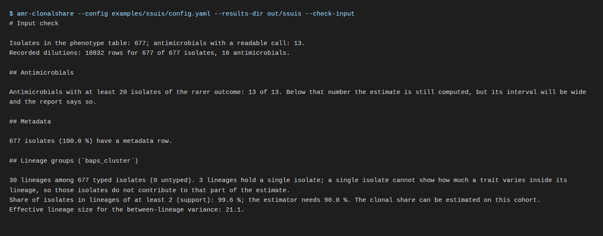

# 3. Check the input

Before any estimate, run the input check alone:

```bash
amr-clonalshare --config config.yaml --results-dir out --check-input
```

It reads the phenotype table, joins the metadata and the dilutions, and
prints a plain-language summary. The
same summary is written to `out/input_qc.md`, with the full record in
`out/input_qc.json`. The full run performs the same step first, so nothing
here is skipped by going straight to the run; the flag only lets you read the
verdict before spending compute.



## What it reports

**The join.** How many isolates of the phenotype table have a metadata row,
with examples of the identifiers that do not, and how many carry a recorded
dilution. Nothing is repaired: an identifier that differs by a space is a
different isolate.

**Per antimicrobial: the count of the rarer outcome.** An agent non-wild-type
in 3 isolates of 500, or wild-type in 3, has three observations that can
inform the question. The tool reports how many agents reach the project's
threshold of 20. Below it the estimate is still computed, and its interval
will show how little it rests on.

**Per lineage: the group sizes and the estimator's verdict.** A lineage with a
single isolate carries one outcome and cannot show how much the trait varies
inside it. The share of isolates in lineages of at least two members is the
*support*, and the clonal-share estimator refuses a cell whose support falls
below 0.90, a threshold read off its measured coverage curve. The check tells you before the run whether your lineage definition
clears it, and if not, that a coarser definition would.

## Is my collection large enough?

There is no single minimum. Two things bind, and the check reports both:

1. **the number of lineages with at least two isolates**, because they alone
   inform the within-lineage variation; and
2. **the count of the rarer outcome per trait**, because a trait nobody carries
   has nothing to decompose.

Adding isolates to lineages already in hand sharpens the realised share (the
question about this collection). It does not sharpen the superpopulation share
(the question about the species), whose precision is set by the number of
lineages. If the aim is the second question, sample more lineages, not more
isolates per lineage.

## Exit codes of this step

`0` the input loaded and the summary was printed; `2` a file, a key or a
column was refused, with one sentence on standard error naming what and
where.
