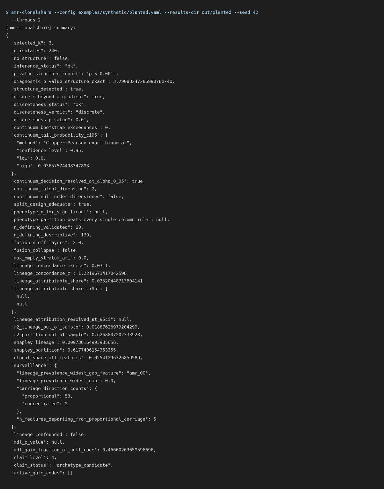

# 4. Run

```bash
amr-clonalshare --config config.yaml --results-dir out --seed 42 --threads 4
```

| option | meaning |
|---|---|
| `--config` | the YAML configuration (required) |
| `--results-dir` | where every output file goes; created if absent |
| `--seed` | the master seed; every stochastic stage is spawned from it, so the same seed on the same stack gives the same record |
| `--threads` | BLAS and OpenMP thread limit |
| `--k-select` | the criterion for the number of profile groups: `auto` (the config), `mdl`, `prediction_strength`, `gap`, `bic_mixture` |
| `--check-input` | stop after the input check |
| `--validate` | run the planted-truth recovery check on synthetic data instead of the analysis; not an input check |
| `--quiet` | suppress the summary on standard output |



## What happens, in order

1. **Input check.** As in the previous page; a refusal stops here.
2. **Gating.** Traits outside the prevalence gate, or present in fewer than
   `min_count` isolates, are set aside and listed; they cannot inform a
   distance.
3. **Distances and fusion.** One binary distance per layer, with the stated
   convention for two all-zero rows, fused by similarity network fusion with
   order-invariant neighbour selection.
4. **Number of groups.** A sweep over `k_range` that always includes one group,
   so a cohort with no structure is reported as having none.
5. **Diagnostics before release.** Whether the largest group is the trait-absent
   stratum, whether ties make the answer depend on row order, whether the fusion
   collapsed onto one layer, whether the groups reproduce on held-out traits,
   whether they are discrete or a gradient.
6. **The lineage question.** Per trait and for the panel, the clonal share
   estimated out of sample with a cluster bootstrap interval; the share of the
   partition attributable to lineage; an e-value per trait; and, when a
   contrast column is configured, the mix-versus-rate decomposition.
7. **Outputs.** `cluster_result.json` (the full record), `summary.json`,
   `report.md`, `input_qc.json`, `input_qc.md`, `archetype_profiles.tsv`,
   `assignment.tsv`.

## Run time

The planted control (240 isolates, 60 traits) ran in 48 s with two threads on
a laptop, and the adversarial clonal control, which adds the per-trait
lineage attribution, in 77 s. The cost is dominated by the bootstrap and
permutation counts in the `attribution`, `surveillance` and `evidence`
sections of the config, which scale linearly; halve them for a first look and
restore them for the run you report.

## Reproducing a run

The record carries the seed, the configuration, and the library versions.
Two runs on the same stack with the same seed give the same record. Two runs
on different BLAS builds agree on every reported decision and every share to
the precision reported, and can differ in the last digits of a bootstrap
interval; the container removes that difference.
