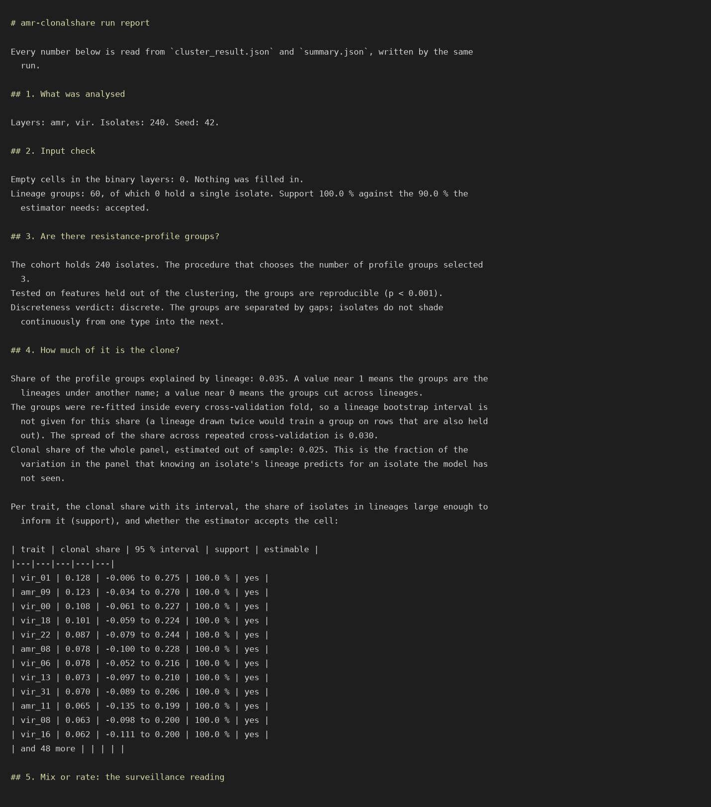

# 5. Read the results

Start with `report.md`. It has the same six sections on every run, states in
plain language what each number means, and reads every figure from the record
beside it. Then open `summary.json` for the machine-readable digest, and
`cluster_result.json` only when a specific number has to be traced.

## The six sections of the report

**1. What was analysed.** Layers, isolates, seed, version.

**2. Input check.** Empty cells and the policy applied; the lineage support
and whether the estimator accepted the cohort at this typing resolution.

**3. Are there resistance-profile groups?** The number of groups selected.
One group means the profiles do not fall into separable types, and the report
says so as a result rather than a failure. For more than one group: whether
they reproduce on traits held out of the clustering, and whether they are
separated by gaps or sit on a gradient.

**4. How much of it is the clone?** The share of the grouping explained by
lineage with its interval, whether the cohort is lineage-confounded, and a
per-trait table of clonal shares with intervals, support and the estimator's
verdict. This is the section a control programme reads.

**5. Mix or rate.** Present when two collections were contrasted. How many
traits differ because the collections hold different lineages, how many
because resistance changed inside lineages, and which show both moving in
opposite directions so that a prevalence table calls them stable.

**6. What may be concluded.** The highest claim the diagnostics support, the
gates that are active, and the diagnostic failures if any. A gate is not an
error; it marks a reading the data cannot support, and the record keeps the
numbers behind it.

## summary.json

The digest a script reads. The fields that decide the reading:

| field | meaning |
|---|---|
| `selected_k` | number of profile groups; `1` with `no_structure: true` is the null result |
| `inference_status` | `ok`, or `withheld_inadequate_split_design` when the panel cannot be split into training and test halves |
| `structure_detected`, `p_value_structure_report` | whether the groups reproduce on held-out traits |
| `discreteness_verdict`, `discrete_beyond_a_gradient` | gaps between groups, or a gradient |
| `lineage_attributable_share`, `..._ci95` | share of the grouping explained by lineage, with interval |
| `lineage_confounded` | `true` when that share reaches the gate: read the groups as lineages |
| `clonal_share_all_features` | out-of-sample clonal share of the whole panel |
| `claim_level`, `active_gate_codes` | the claim ladder and the gates that limit it |

## cluster_result.json

The full record: the configuration as run, every diagnostic with its inputs,
the per-trait clonal shares (`metadata_diagnostics.clonal_share`), the e-values
(`metadata_diagnostics.lineage_evidence`), the decomposition
(`metadata_diagnostics.prevalence_decomposition`), the censored-panel reading,
and the provenance. It is strict JSON: no `NaN`, no `Infinity`, so any parser
reads it.

## assignment.tsv and archetype_profiles.tsv

The group of each isolate with its assignment confidence and stability label,
and the trait profile of each group with the traits that define it after
false-discovery control.
