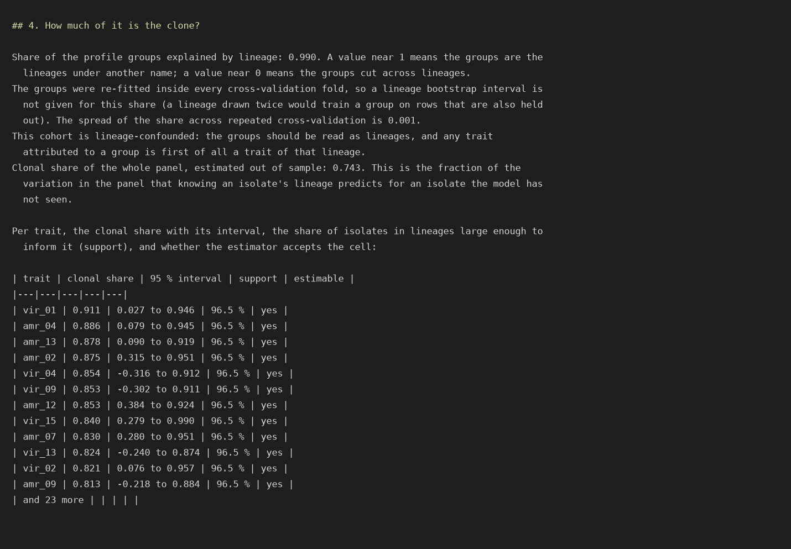

# 6. The clonal share, agent by agent

## The question

For one antimicrobial, take the non-wild-type call of every isolate. Some of
the variation in that call sits *between* lineages (one lineage is mostly
resistant, another mostly susceptible) and some sits *within* them (isolates
of the same lineage differ). The clonal share is the between part as a
fraction of the whole. Near 1: the resistance travels with the clone, and the
intervention is against the clone. Near 0: the resistance moves across
lineages, and the intervention is against the selecting agent.

## Two shares, two questions

The tool reports two quantities and does not let one interval stand for both.

| | question | interval | precision grows with |
|---|---|---|---|
| **realised share** | in *this* collection, holding *these* lineages, how much sits between them | exact, from the noncentral F | isolates per lineage |
| **superpopulation share** | if new lineages were drawn from the species, how much would sit between them | cluster bootstrap | number of lineages |

A veterinary collection usually holds few lineages and many isolates, which is
the case where the two diverge most. The realised share is what a laboratory
holding one collection usually means.

## Why the estimate is out of sample

A lineage label with many levels can "explain" a trait by memorising it. The
clonal share is therefore estimated on isolates the lineage model has not
seen, in repeated cross-validation, with the fold means debiased and the
interval drawn by resampling whole lineages. A label that carries no
information scores zero, not the number of its levels.

## The gates, and what they mean for you

**Support below 0.90.** Too many isolates sit in single-member lineages for
the within-lineage variation to be measured. The cell is reported as not
estimable. Use a coarser lineage definition, or accept that this collection
cannot answer the question at this resolution.

**Residual kurtosis above the limit.** The exact interval for the realised
share rests on the within-lineage departures having tails no heavier than the
Gaussian; the gate is one-sided and was read off the measured coverage curve.
Binary traits are lighter-tailed than Gaussian and pass it; the interval's
coverage on binary traits is reported separately in the validation ledger.

## Reading the per-trait table

Section 4 of `report.md` lists every trait with its clonal share, the 95 %
interval, the support and the estimator's verdict, sorted by share. The
interval is the statement: a share whose interval sits below 0.5 says the
trait moves mostly across lineages in this collection; one whose interval sits
above 0.5 says it is mostly a lineage trait here; one that spans 0.5 says the
collection cannot yet tell, and the input check says which of the two binding
quantities would sharpen it.

## The e-value

Beside each share is an e-value: the evidence that the lineage carries *any*
information about the trait, on a scale that stays valid when the same panel
is re-read every year. An e-value of 20 corresponds to a decision at the 0.05
level, 100 to the 0.01 level, and the values from successive years multiply.
False-discovery control across the panel uses the e-BH procedure, which holds
under any dependence between antimicrobials.

## What the share is not

It is not heritability, which partitions variance against a relatedness
matrix estimated from the genome; the random effect here is a discrete label
whose resolution is an analytical choice. It is not the accuracy of a
lineage-based classifier, which is bounded below by the majority class: a cell
at 90 % prevalence scores 0.90 with no lineage information at all, while the
clonal share returns zero.
