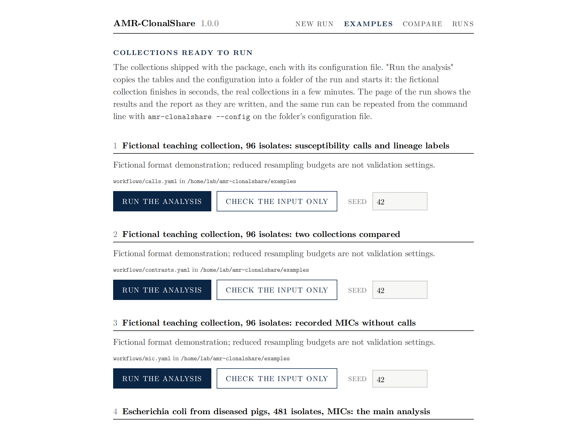
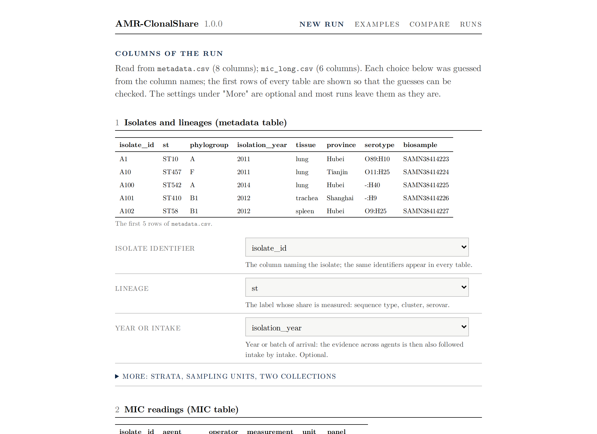
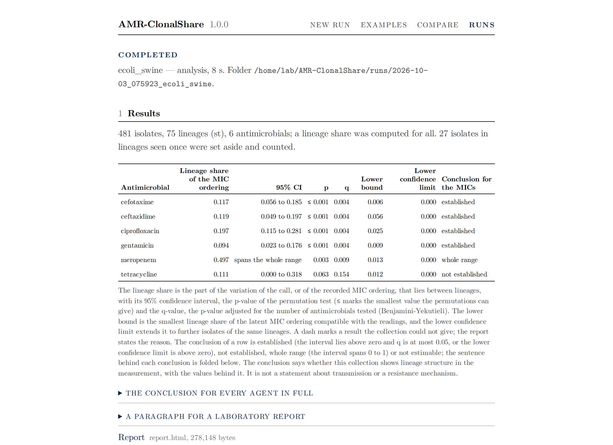

AMR-ClonalShare reads a lineage label per isolate (sequence type, cluster, serovar) with susceptibility calls, recorded MICs or both, and reports, per antimicrobial, how much of the result the lineages of the collection account for: the lineage share with its confidence interval and permutation test, the bounds on the lineage share of the latent MIC ordering, and one conclusion per agent. This page shows the three steps of a first run with the Windows folder; the manual in the folder (`manual/index.html`, also the "Manual" link at the foot of every page of the form) and Appendix C of the article describe every setting.

## 1. Start the form and run an example

Double-click `AMR-ClonalShare.bat`. A console window opens and stays open while you work; after a few seconds the browser opens on the Examples page. If Windows warns that the folder is not from a known publisher, choose "More info", then "Run anyway". If the browser does not open, paste the address printed in the console into it.

{width=4.2in}

Click "Run the analysis" under the fictional teaching collection: the page of the run refreshes itself and, after a few seconds, shows the results table, the files of the run and the report. The *Escherichia coli*, *Streptococcus suis* and *Salmonella* collections run the same way, with the seed of their published record.

## 2. Your own tables

Go to "New run" and choose, or paste from a spreadsheet, the tables of your collection: a metadata table with the isolate identifier and its lineage, a call table (S/I/R, wild-type/non-wild-type or 0/1) and a MIC table with the recorded concentration and its sign (`<=0.5`, `8`, `>16`), each with one row per isolate and antimicrobial or one column per antimicrobial. One sheet with the identifier, the lineage and one column per antimicrobial is a complete input. Semicolons, decimal commas, agent codes such as `CIP` and `n.d.` for an untested agent are read as they come.

{width=4.2in}

The Columns page shows the first rows of every table beside the column choices, guessed from the column names; check them. For a MIC table, open "More" and declare the tested concentrations of every agent, either by typing them, by "Use the observed range" or by choosing a panel preset of the EU harmonised panels; the page warns where many readings sit on the lowest or highest recorded concentration while no range is declared. "Check the input only" reads the tables and reports what every analysis would use, in seconds; "Run the analysis" does the same and then runs.

## 3. Read the result

{width=4.2in}

The results table gives, per antimicrobial, the lineage share with its 95 % interval, p-value and q-value, for MICs the lower bound on the lineage share of the latent ordering and its lower confidence limit, and the conclusion of the row: *established*, *not established*, *whole range* or *not estimable*; the sentence behind each conclusion, with the numbers that decide it, is folded below the table, and a paragraph for a laboratory report can be copied from the page. The conclusion is a statement about the collection analysed, not about transmission. The report of the run opens on the page and in a tab of its own; every file of the run is in a folder under `C:\Users\<you>\AMR-ClonalShare`, with the configuration that repeats the run from the command line: `amr-clonalshare.cmd run --config <folder>\config.yaml --results-dir <new folder>`.
